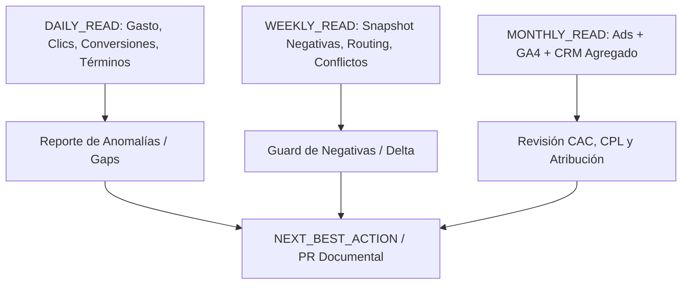

# Marketing Official-First Read Control Plane & Capabilities V01

Estado: `DOCUMENTADO_VALIDADO_OFFLINE`
Fecha: 2026-09-05
Issue padre: `misaeln-pc1/marketing-performance-capacita#85`
Tarea canónica: `misaeln-pc1/capacita-task-hub#215`
Rama: `feature/marketing-official-read-control-plane-p0`

## 1. Propósito y Principio Rector

Frente al incremento de costos en Google Ads y Meta Ads, Marketing requiere un control plane oficial-first estrictamente **READ-ONLY** que elimine la dependencia de prompts manuales y asegure mediciones consistentes.

Principio rector:
```text
OFFICIAL_FIRST_READ_ONLY
ZERO_MUTATION_OPERATIONS
NO_SECRETS_NO_PII_IN_GITHUB
REUSE_BEFORE_REINVENT
CANONICAL_HEAVY_STORAGE=SHAREPOINT
```

---

## 2. Inventario de Capacidades del Entorno (Fase 1.1)

| Recurso / Herramienta | Estado Observado | Tratamiento / Conclusión |
|---|---|---|
| **Git y rama** | `feature/marketing-official-read-control-plane-p0` | Creada desde `d1ddbcc40c6472d329a1b45005859dee7fb3db6e`. Rama aislada de `main`. |
| **PowerShell** | PowerShell 5.1 (Build 26100) | Runner nativo en Windows para scripts locales. |
| **Python** | Python 3.14.3 (`C:\Python314\python.exe`) | `google.ads.googleads` disponible; `google.analytics.data` y `googleapiclient` no instalados en global. |
| **Config Google Ads local** | `c:\...\0-Origen\google-ads.yaml` | Presente fuera del repo; usa ADC (`use_application_default_credentials: true`). |
| **Runner Google Ads** | `c:\...\0-Origen\run-google-ads-keywords.ps1` | Presente fuera del repo. |
| **GitHub CLI (`gh`)** | Autenticado como `misaeln-pc1` | Permisos de repo y lectura de PRs/issues. |
| **MCPs configurados** | `filesystem`, `notebooks`, `visualization`, etc. | Google Ads MCP, GA4 MCP y GSC MCP no configurados en el IDE. |
| **Almacenamiento pesado** | SharePoint Empresa / OneDrive | Fuente canónica: `SharePoint Site / Documentos / CAPACITA/Proyectos/external-files/marketing-performance-capacita`. Acceso local sincronizado: `OneDrive "Sitio de comunicación - external-files"`. |

---

## 3. Google Ads: Comparativa METHOD_A vs METHOD_B (Fase 1.2 y 1.3)

- **METHOD_A:** Google Ads API / PowerShell Fast Path existente en el repo (`scripts/google_ads_readonly/`).
- **METHOD_B:** Google Ads MCP Oficial (`googleads/google-ads-mcp`).

### Diagnóstico de Autenticación en Smoke Test

Al ejecutar el smoke-test read-only de clientes accesibles (`list_accessible_customers.py --execute`):
```text
Request had insufficient authentication scopes. [reason: "ACCESS_TOKEN_SCOPE_INSUFFICIENT"]
```
Causa: El token ADC local no cuenta actualmente con el scope `https://www.googleapis.com/auth/adwords` activo.
Regla aplicada: Límite de 2 intentos alcanzado; detener intento de conexión viva y declarar `HOLD_WITH_EVIDENCE`.

### Matriz Comparativa (13 Preguntas Obligatorias)

| # | Dimensión / Pregunta | METHOD_A (Fast Path API/Python) | METHOD_B (Google Ads MCP Oficial) | Ganador por Tarea |
|---|---|---|---|---|
| 1 | **Cuentas accesibles** | `CustomerService.list_accessible_customers` con máscara. | Herramienta `list_accessible_customers`. | **Empate** |
| 2 | **Campañas activas** | GAQL en `export_campaign_summary.py`. | GAQL vía tool `search`. | **Empate** |
| 3 | **Gasto últimos 7 y 30 días** | Script específico con date range en GAQL. | Consulta GAQL dinámica vía prompt. | **METHOD_A** (script reproducible) |
| 4 | **Campañas con mayor gasto** | Ordenamiento local y cálculo de ratios. | Requiere síntesis en contexto LLM. | **METHOD_A** (sin consumo de tokens) |
| 5 | **Keywords y Quality Score** | Reporte `export_campaign_summary.py`. | GAQL ad_group_criterion. | **Empate** |
| 6 | **Search terms** | `export_missing_reports.py` paginado a TSV/CSV. | GAQL search_term_view (limitado por buffer MCP). | **METHOD_A** (mayor volumen de filas) |
| 7 | **Landing pages** | GAQL landing_page_view en script local. | GAQL landing_page_view vía MCP. | **Empate** |
| 8 | **Dispositivos / Red** | Breakdowns tabulados y exportados a CSV. | GAQL segmentado por device. | **Empate** |
| 9 | **Conversion actions** | GAQL conversion_action / metrics. | GAQL conversion_action vía MCP. | **Empate** |
| 10 | **Datos faltantes / Gaps** | Detecta y escribe flags `DATA_GAP`. | Requiere interpretación conversacional. | **METHOD_A** (determinista) |
| 11 | **Tiempo y pasos manuales** | 1 comando de ejecución en PowerShell. | Conversación multi-paso con el modelo. | **METHOD_A** (fast path) |
| 12 | **Mantenimiento** | Código versionado en el repo de Marketing. | Dependencia de servidor MCP externo y node/python. | **METHOD_A** (control directo) |
| 13 | **Cobertura de negativas vivas** | Cubierto por `NegativeSnapshotManager`. | GAQL query ad_group_criterion / campaign_criterion. | **Empate** |

### Conclusión de Paridad

```text
GOOGLE_ADS_FAST_PATH=HOLD_WITH_EVIDENCE
GOOGLE_ADS_MCP=HOLD_WITH_EVIDENCE
METHOD_PARITY=PARTIAL
FALLBACK=METHOD_A
```

No se sustituye METHOD_A por METHOD_B dado que METHOD_A está completamente adaptado a la infraestructura de Capacita, cuenta con scripts de exportación directa a staging y requiere cero pasos interactivos adicionales.

---

## 4. Estado de Fuentes Conectadas (Fase 1.6, 1.7, 1.8, 1.9)

### Google Analytics 4 (GA4) — Fase 1.6
- **Permitido:** Scope `analytics.readonly`, metadata de propiedad, reportes mínimos de sesiones, landings, fuentes y key events.
- **Prohibido:** Modificar eventos, crear audiencias o usar scopes write.
- **Estado:** `GA4_MCP_READ=HOLD_WITH_EVIDENCE`. Librería `google.analytics.data` y MCP no configurados localmente.

### Google Search Console (GSC) — Fase 1.7
- **Permitido:** Lectura de consultas, páginas, clics, impresiones, CTR, posición, sitemaps.
- **Prohibido:** Google Indexing API para páginas regulares.
- **Estado:** `GSC_OFFICIAL_READ=HOLD_WITH_EVIDENCE`. Credenciales OAuth read-only pendientes de asignación.

### Meta Ads — Fase 1.8
- **Permitido:** Meta Marketing API oficial, scope `ads_read`, cuenta operativa bajo *Otros activos* (`...2327`).
- **Prohibido:** `ads_management`, `leads_retrieval`, writes a campañas o presupuestos, MCP comunitario.
- **Estado:** `META_ADS_READ=HOLD_WITH_EVIDENCE`. Procedimiento saneado y runbook operativo completados en Fase 0; token temporal local no presente en entorno privado. Cero writes ejecutados.

---

## 5. Zoho CRM: Allowlist READ Diseñada (Fase 1.9)

Para enriquecer la atribución sin exponer datos personales ni habilitar writes en el CRM, se define la siguiente allowlist estricta para consultas vía COQL / Data Insights:

```text
ZOHO_READ_ALLOWLIST=DESIGNED
```

### Módulos y Campos Permitidos (Solo Agregados y Hashes)

1. **Módulo Leads / Contacts:**
   - `Lead_Source`
   - `Created_Time`
   - `First_Contact_Status`
   - `Campaign_Source_Sanitized`
   - **Prohibido:** Nombre, Email, Teléfono, RUT, Dirección.
2. **Módulo Deals (Oportunidades):**
   - `Deal_Name_Hash` (identificador sanitizado)
   - `Stage`
   - `Amount`
   - `Closing_Date`
   - `Course_Product_Ref`
3. **Módulo CursoAlumno / Matrícula (si aplica):**
   - `Course_Code`
   - `Enrollment_Status`
   - `Payment_Confirmed_Flag`
   - `Modality`

### Guardrails de CRM
- Cero operaciones de `create`, `update`, `delete`.
- Cero triggers de workflows, Deluge scripts o envío de emails.
- Extracción exclusiva de métricas agregadas (ej. recuento de leads calificados por fuente).

---

## 6. Diseño de la Automatización Periódica

Se diseña la arquitectura de lecturas programadas **sin activar ningún cron ni scheduler productivo** en esta fase:



### 1. DAILY_READ
- **Métricas:** Gasto diario, clics, impresiones, conversiones de plataforma, términos de búsqueda con gasto > umbral, frecuencia y anomalías.
- **Salida:** Reporte diario Markdown sanitizado guardado fuera de Git o en staging.

### 2. WEEKLY_READ
- **Métricas:** Snapshot vivo de negativas, auditoría de términos irrelevantes, verificación de routing A/B/C, salud de landings, posicionamiento SEO orgánico.
- **Salida:** Ejecución de `NegativeGuard` para detectar deltas y proponer recomendaciones justificadas vía Issue/PR.

### 3. MONTHLY_READ
- **Métricas:** Reconciliación cruzada Ads → Landing → CRM (leads, deals, matrículas confirmadas). Cálculo de CPA, CPL, CPQL y CAC agregado.
- **Salida:** Informe ejecutivo mensual de rendimiento comercial.

---

## 7. Guardrails de Seguridad y Gobernanza

1. **ADS_WRITES = 0:** Ningún script, MCP o llamada API modifica presupuestos, campañas, anuncios, keywords o estados.
2. **CRM_WRITES = 0:** Ningún registro de Zoho CRM es creado, editado o eliminado.
3. **PRODUCTION_WRITES = 0:** Sin cambios en servidores web, Cloudflare, Edge o GTM.
4. **SECRETS_IN_GITHUB = 0:** Verificado mediante escaneo regex de patrones de tokens y claves en el diff.
5. **PII_IN_GITHUB = 0:** Verificado mediante escaneo regex de emails y números telefónicos.
