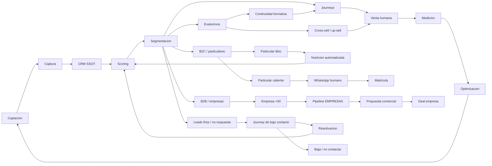

# Flujo Maestro

## Lectura rapida

El flujo principal mantiene a Zoho CRM como fuente unica de verdad. Las rutas separan particulares, empresas, exalumnos y leads frios para evitar que venta humana persiga contactos sin senal suficiente.
