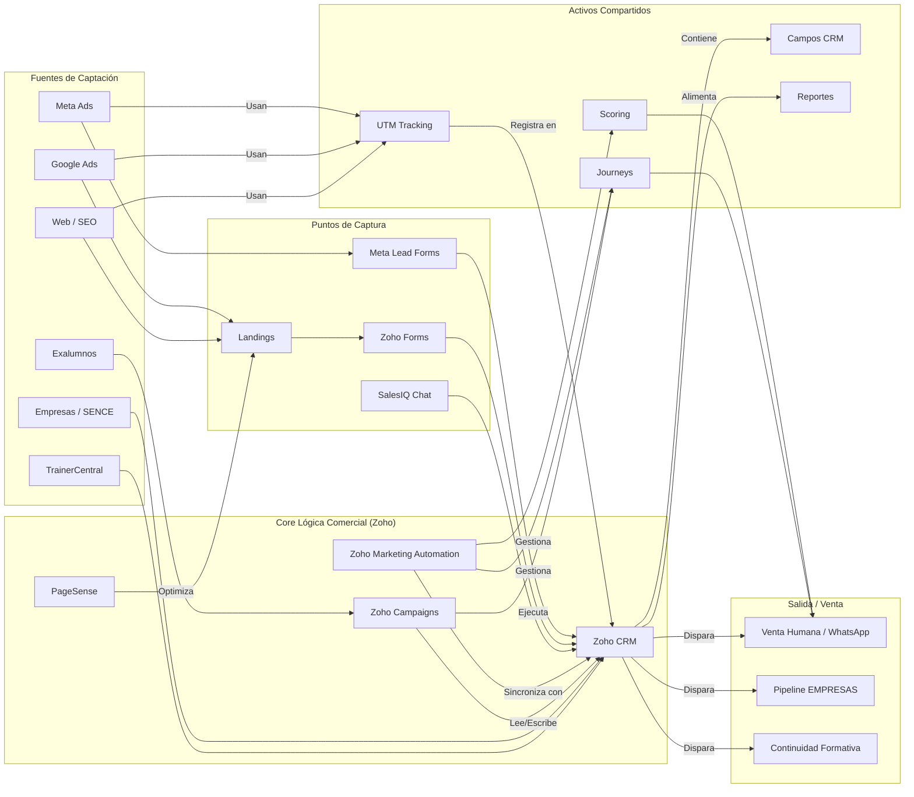

# Relaciones entre Proyectos e Infraestructura

Este documento contiene un mapa visual que ilustra cómo los diferentes proyectos y sistemas se conectan e influyen entre sí.

## Diagrama de Flujo

## Lectura del mapa

Este mapa no pretende mostrar cada detalle técnico, sino las **dependencias lógicas** entre los componentes del sistema.

Su propósito principal es servir como una herramienta de **análisis de impacto**. Antes de modificar un componente (ej: un campo en Zoho CRM), se puede consultar este mapa para identificar rápidamente qué otros sistemas o proyectos (ej: Formularios, Journeys, Reportes) se verán afectados.

Esto ayuda a prevenir errores en cascada y asegura que los cambios se realicen de manera controlada, comunicando a los responsables de las áreas impactadas.